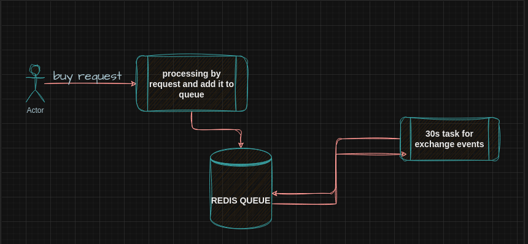

# Buy-cryptocurrency
A simple cryptocurrency purchase system :)

### Overview


1. The user sends a purchase request for any digital currency
2. We process the purchase request and then add the event to redis
3. A 30-second task takes the events inside Redis and processes and exchanges them.
4. Then it deletes the exchanged events from redis.

## How To Run?
**Note**: *You need to have `docker` and `docker-compose` installed.*

Then just run the following commands:

```bash

# clone the project
git clone https://github.com/TorhamDev/buy-cryptocurrency.git
# or usin ssh
git clone git@github.com:TorhamDev/buy-cryptocurrency.git

cd buy-cryptocurrency

# run project with docker and docker-compose
docker-compose up -d

# enjoy :)
```
